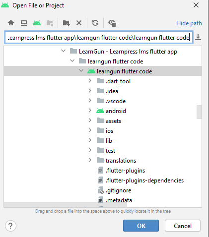
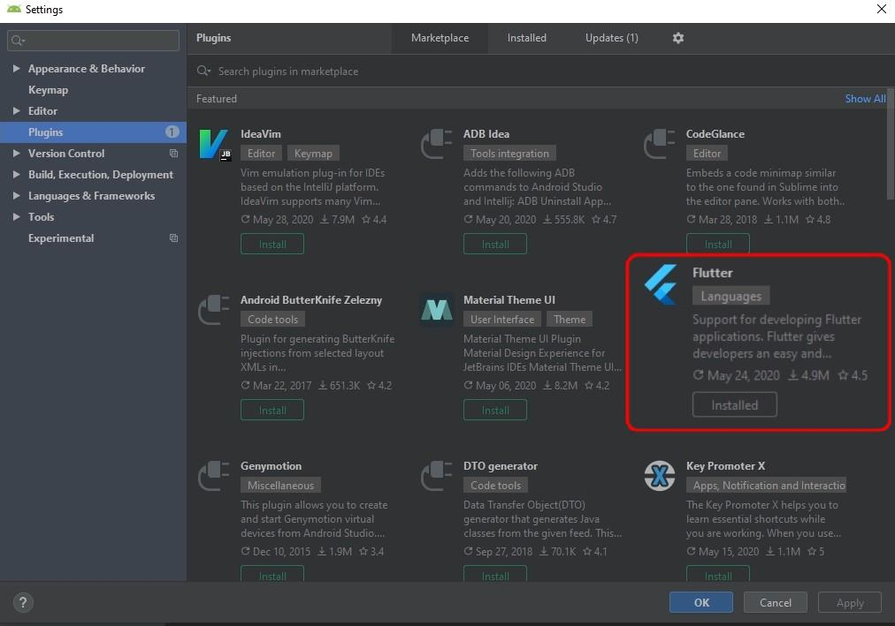
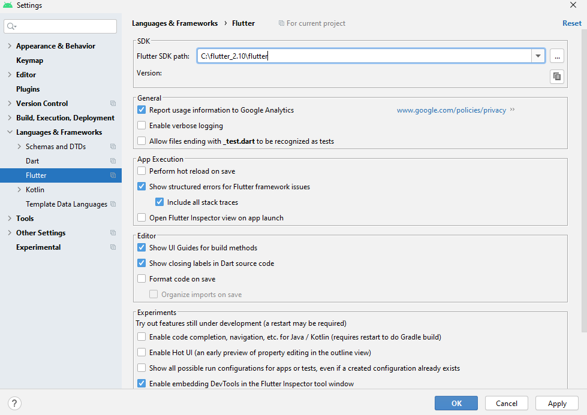

## Android studio Setup

First, unzip the learngun flutter code. Then open Android Studio and open the existing learngun flutter app project in it.

Now you need to install the **Flutter plugin**. Go to **File > Settings > Plugin**. Search for the Flutter plugin and click **Install**.

After this step, follow to **Settings > Languages & Frameworks > Dart** to set up Dart SDK.

Enter the **Dart SDK Path** in the field provided.

Specify the path to the unpacked archives from the previous step.

Then move on to the Flutter tab and enter the **Flutter SDK Path**.

Now when everything is ready, you can start building your Android App.

