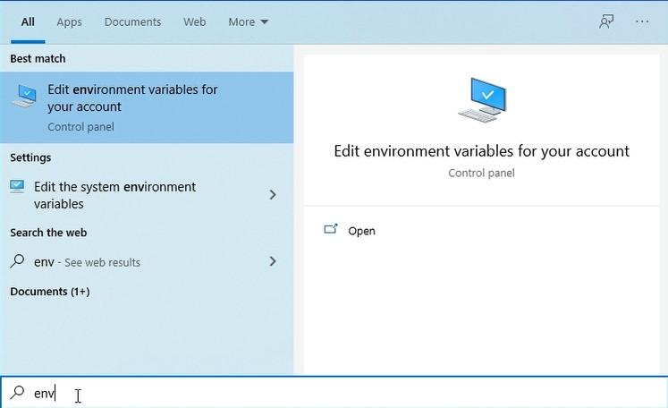
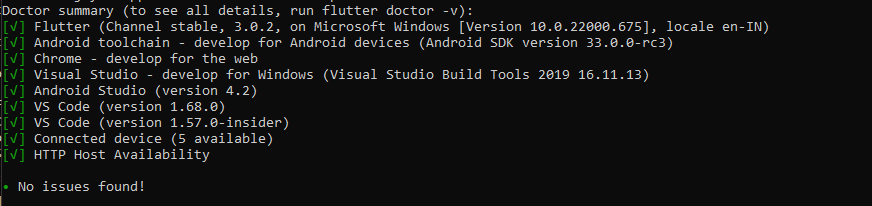

## Flutter Setup

Download the Flutter zip file for system: [https://flutter.dev/docs/get-started/install/windows#get-the-flutter-sdk](https://flutter.dev/docs/get-started/install/windows#get-the-flutter-sdk)

Extract the zip file and place it in the desired installation location for Flutter SDK (for example, C:\src\flutter).

After that, you also need to download Dart SDK. Use this link to download the file - [https://dart.dev/get-dart](https://dart.dev/get-dart)

Extract the downloaded file to the same folder you extracted Flutter, you will need this folder for the further Android Studio setup.

> Do not install Flutter in a directory like C:\Program Files\ that requires elevated privileges.

Using the Start search bar on your computer, enter “env” in the search field and select the option Edit environment variables for your account.

Next, in the Environment variables in the User Variables field check if there is an entry called Path.

* If the entry exists, add a full path to flutter\bin.
* If the entry doesn’t exist, create a new user variable named Path with the full path to flutter\bin.

After that, you need to run the command flutter doctor, which will help you to identify if there are any dependencies you need to install in order to complete the setup.
Run this command:
    C:\src\flutter>flutter doctor

When the flutter doctor finishes checking, you can complete the installation of Flutter SDK.