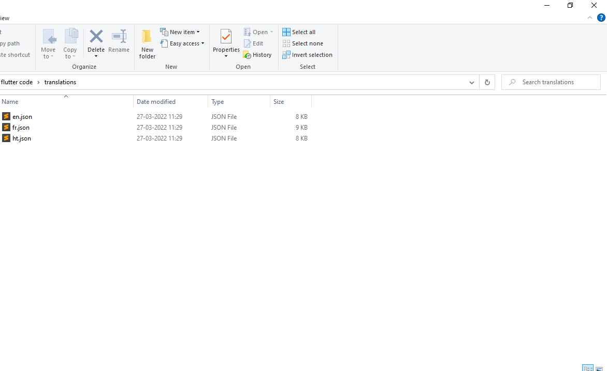

## Language Switch

on **lib/translations** folder, you can find the json key-values pair of the string translations throughout the app.

copy and paste the en.json file and rename the new one to the country code or name of the language that you want to add to language switch and just change the json strings one by one.

> Use [https://poeditor.com/](https://poeditor.com/) for easy json translation to your desired language

edit **translationSwitch** variable on **lib/utils/costants.dart** and add a list with Language name first and filename of the file that you have created for the translation file second, same as the one in sample. Also, remove the items in list that you don't want in language switch.

change **defaultLanguage** with the language file name of the default language. Also, add a image on **assets/flags** with the language name as file name.