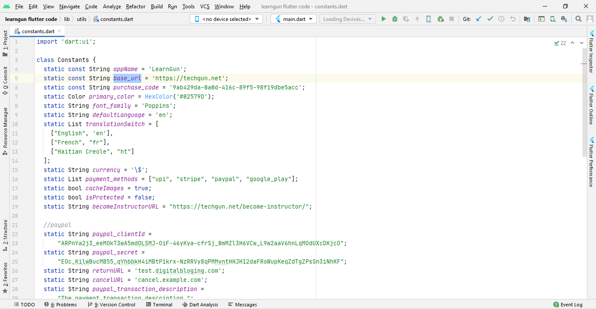

## Setting the Site URL

Now you need to edit one file in order to include in the data your website address, thus, enable the synchronization of your site and app.
Open the folder with the app and find the following file there: **lib/utils/constants.dart**
Open the file **constants.dart** via Notepad or similar editor.
In this file, you will see the following string: static const **base_url**. Paste your website URL here.

Now you can follow to the next step of adding the icon to your mobile application. See the next section.