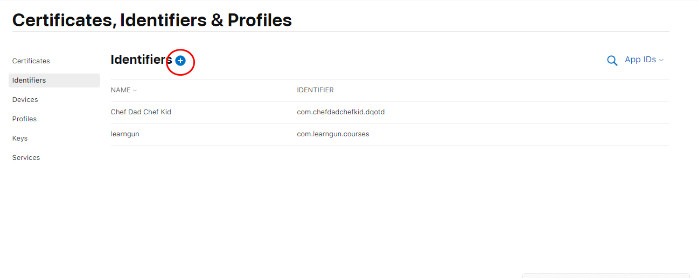
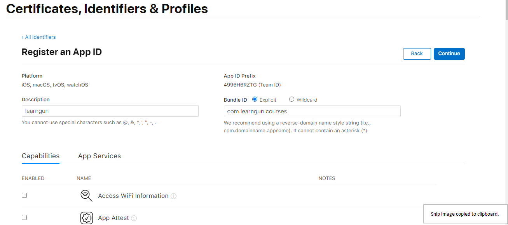
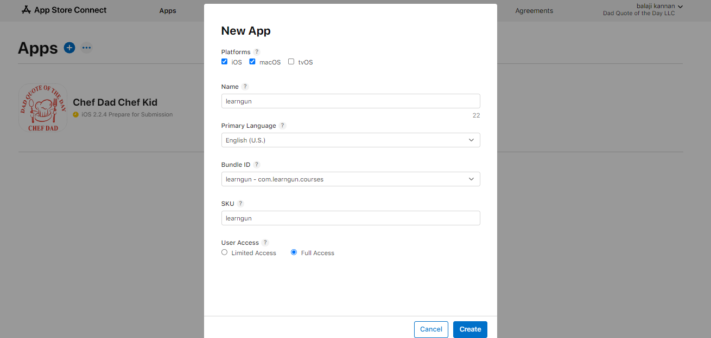

## IOS developers account configuration

You must first purchase IOS developers account before you could test the app on your phone. You can purchase from [here](https://developer.apple.com/programs/)

Once you have purchased, you will get access to [https://developer.apple.com/](https://developer.apple.com/), in which you need to navigate to [Identifiers](https://developer.apple.com/account/resources/identifiers/list) and hit add new

Select  **"App IDs"** and hit "continue"and select "App"

Select any app description and your desired bundle ID

In capabilities, select the following
1. Associated Domains - Opening app links
2. Push Notifications
3. Sign In with Apple

and continue to register the identifier.

Then, on [https://appstoreconnect.apple.com/](https://appstoreconnect.apple.com/), on My Apps, Add **New App** for the registered identifier your app details and then proceed to fill the other required app details, including description, screenshot and so.

