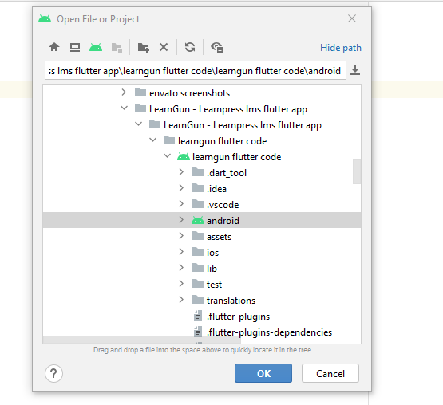
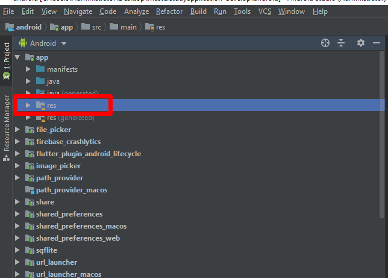
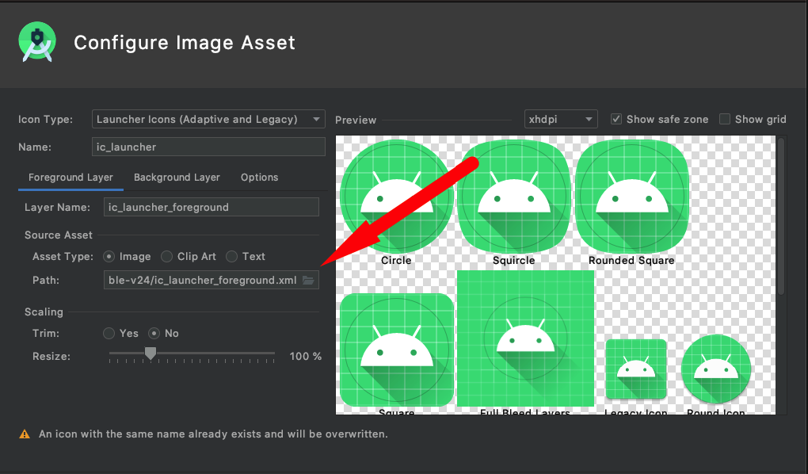
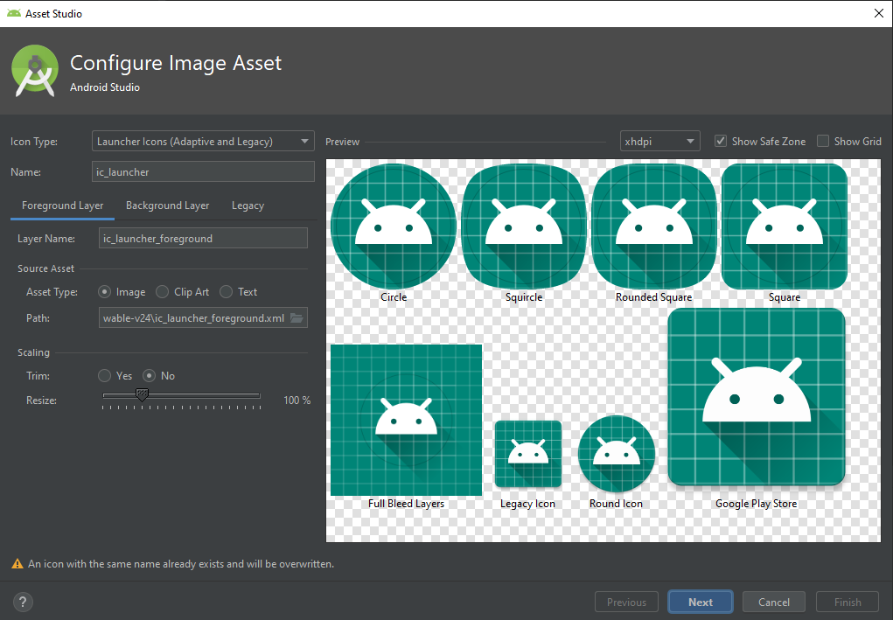

## Adding App Icon

Your next step is to return to **Android Studio.** Go to **Open an existing AS project**, find your app project and open the android folder there.

Open the following folder: …/app/src/main/res and double click on the folder res.

There will be the menu, where you need to hover over the New line and select from the submenu Image Asset.

Select your icon from your PC or device and set it up.

> The more detailed documentation about Image Asset work you can find here: [https://developer.android.com/studio/write/image-asset-studio](https://developer.android.com/studio/write/image-asset-studio)