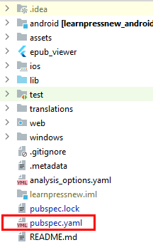
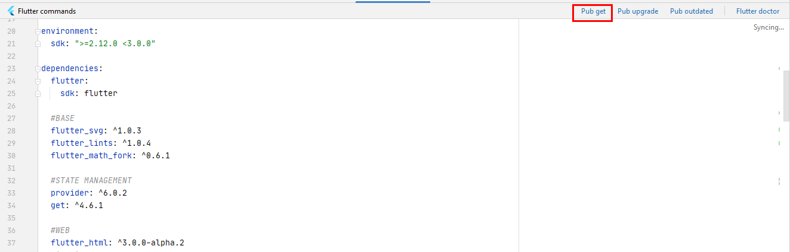
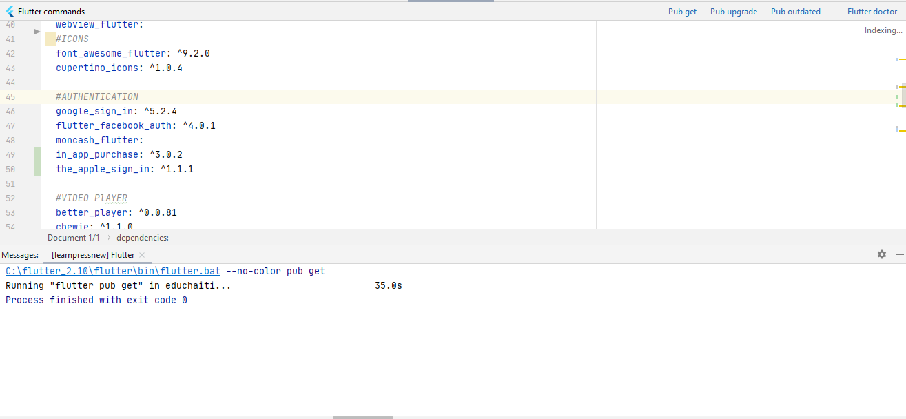

## Installing Flutter Packages

You continue to work in the same folder of the learngun flutter App that you opened in the previous step.
Open the **pubspec.yaml** file. Click on your learngun flutter project then find the file **pubspec.yaml.**

Click on the **Packages get.**

Wait for the process to finish.

Now you can check your app. For this, activate the emulator and click run.