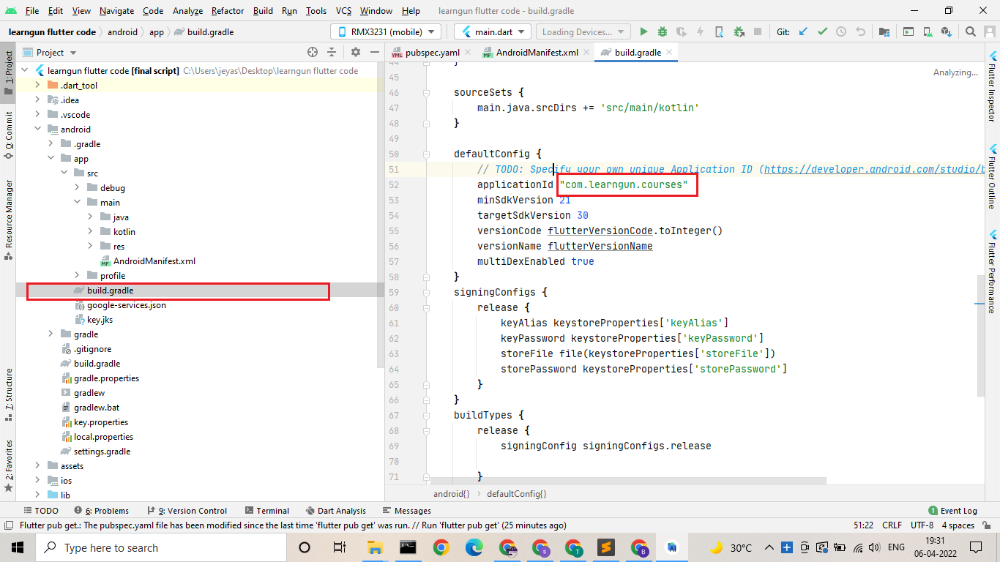
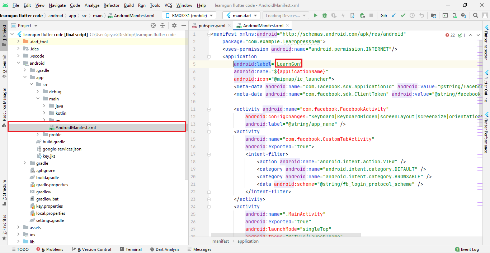
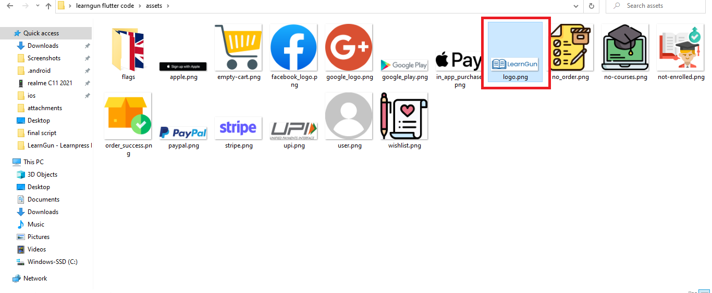

## changing package name

open **android/build.gradle** file and change **applicationId** on line 52

## changing app name

open **android/app/src/main/AndroidManifest.xml** file and change the **android:label** to your app name.

## changing splash

Open assets folder on code's root folder and replace **"logo.png"** with your logo

After replacing, run the following command from terminal on root project folder
> flutter pub run flutter_native_splash:create
