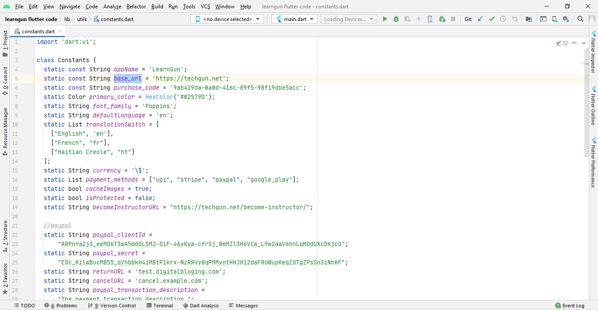

## Basic changes

open **lib/utils/constants.dart**

**appname** - Change to your app name

**primarycolor** - Primary color of the app in HEX Code

**font_family** - Google font family name as on google fonts website [https://fonts.google.com/](https://fonts.google.com/)

**currency** - currency symbol used throughout the app

**becomeInstructorURL** - Link to your website's become instructor url

**isProtected** - If set to true screenshot and screenrecording will not be allowed within the app.

**cacheImages** - If set to true, images served everywhere throughout the app will be cached and served.

**payment_methods** - List of payment methods that you want to have on your app. Remove the payment methods that you don't want from the list.

**resourcesSection** - List of resources that must be visible on frontend of app.
