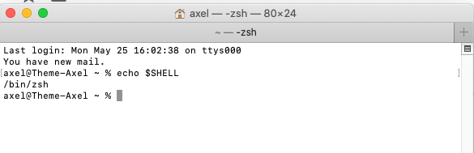
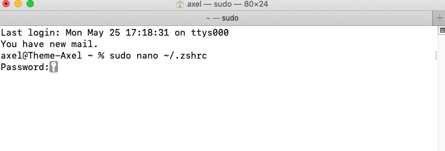
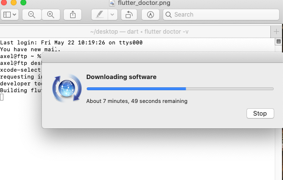

## Flutter Installation

First, download the Flutter here: [https://flutter.dev/docs/get-started/install/macos](https://flutter.dev/docs/get-started/install/macos)

When you created the folder with Flutter SDK, open it in Terminal using the following command:

	cd ~/development

If there is no development folder run this command first:

	mkdir /development

After that, you need to run the unzip command. Make sure you specify the correct path to the downloaded Flutter archive file.
Run the command below:

	unzip ~/Downloads/flutter_macos_3.0.5-stable.zip
	
## Setting the Flutter tool path

In order to set up the Flutter tool path you should run this command:
	export PATH="$PATH:pwd/flutter/bin"

Next, you need to know which shell you are using. For this run this command:
	echo $SHELL

Depending on the shell run the following command:

	sudo nano ~/.zshrc

or

	sudo nano /.bashrc
Again, the command you will be using depends on the shell you have

After that in the new window, you need to add a path to the flutter tool.
Use the following command:

	export PATH=$PATH:~/development/flutter/bin

The next thing you need to do is to check the Flutter dependencies.
For this, run the command:
	flutter doctor

This operation will help you to identify if there are any dependencies you need to install.
After the results will be prepared click Agree and wait for the installation of the needed dependencies to complete the setup

