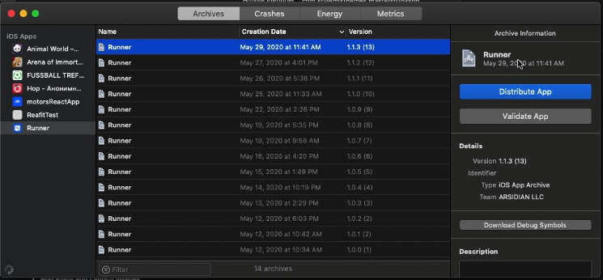
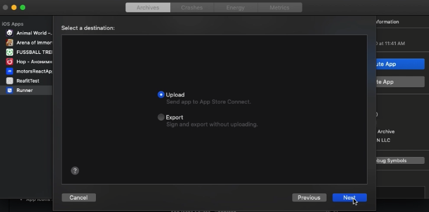
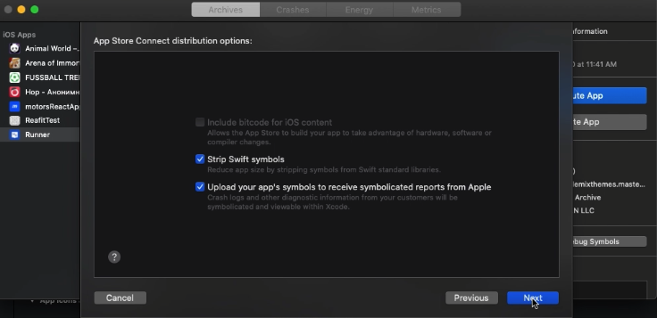
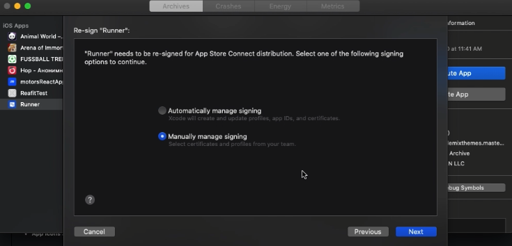
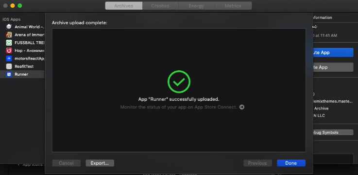

## IOS App Build

First, install [Xcode](https://developer.apple.com/xcode/) on you mac.

Launch Xcode and open the file Runner.xcworkspace which is located in the ios folder.

Go to File > Runner and enter the **Version** and **Build** in the specified fields.
In the **Display Name** enter the **name of the app**.

## Add your App Icon

You can add icons to your app in the App Icons and Launch Images section of the Xcode General panel. To add icons click on the arrow icon and open the asset catalog

  Tip: Follow the [Human Interface Guidelines](https://developer.apple.com/design/human-interface-guidelines/ios/icons-and-images/app-icon/) when creating the app icon. You can use the [App Icon Generator tool](https://makeappicon.com/).

Alternatively, select the asset catalog containing your app icon set in the Project navigator and drag variations to the wells.

Finally, review the icon set has been applied by running your app using Xcode device simulator

After that, click Product > Archive and wait while the runner is archiving.

When the process is finished, in the popup window click Distribute App.

Select upload option to **Send app to App Store Connect**.

Next, select profile and continue. Once the process is finished, click on Upload.

After that, select the option Manually manage signing.

The uploading process will start, wait until it is finished.

Archive upload successfully completed.