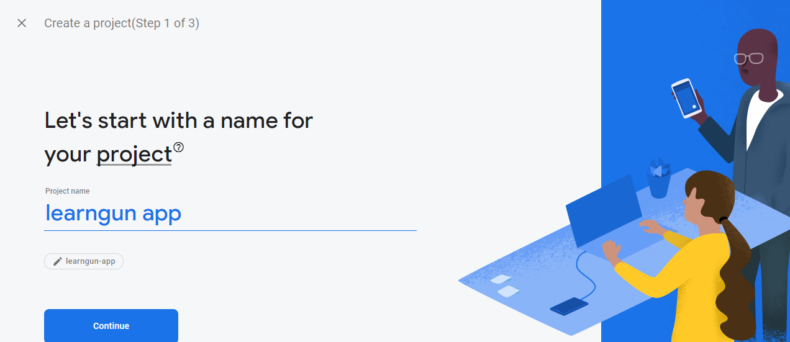
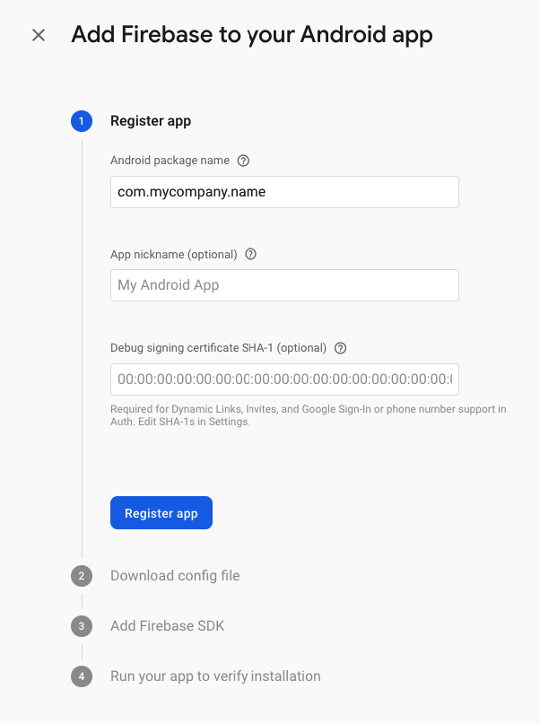
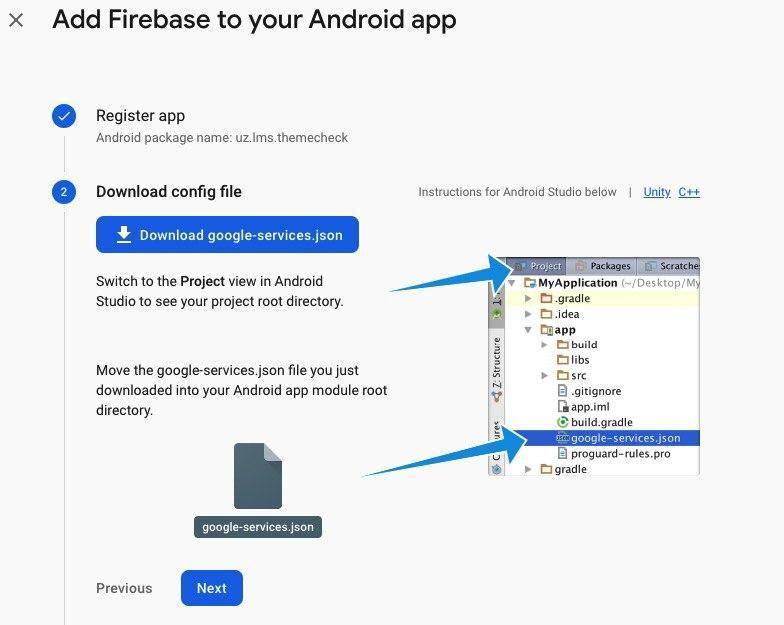
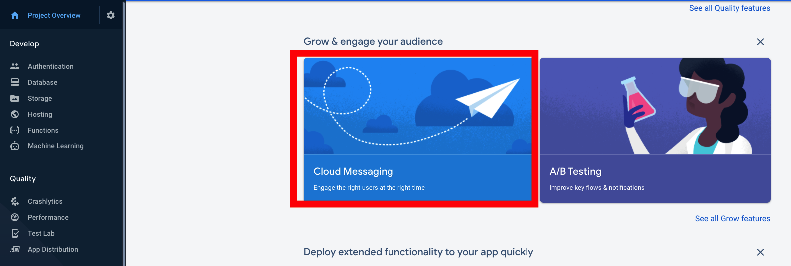
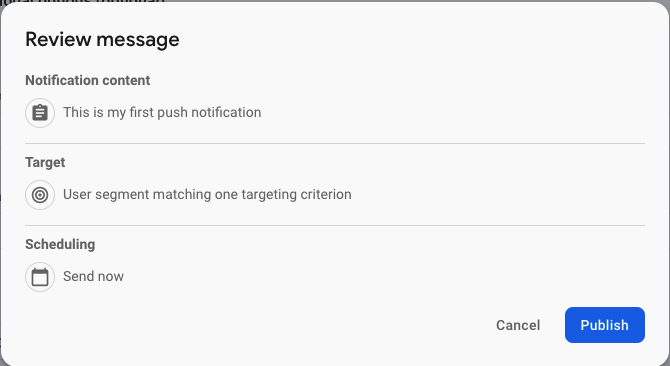

## Firebase Notification And Google Login

Firebase Notification And Google Login feature is integrated with Google Firebase service. You need to sign up on the Firebase website and create a new project. Then, add your app to your Firebase project to register app.

Create a new project.

In the newly opened window enter the name of the project. And click **Continue**.

Next, select Google Analytics account or create a new one. Click on the Create Project.

Wait for the project to load.

On the opened page select the app platform Android.

Write the package name and click on the Register app.

The config file will be generated. You need to download it and upload to the following folder: Android > App in the project Learngun App.

You will be notified that the file with the same name already exists. You need to confirm that you want to replace it.

### Push Notification

Find the **Cloud Messaging** menu on the Firebase Dashboard.

On the new page click on the **Send your first message** button.

Fill in the required fields and click on **Next**.
Please note before sending the test message, first you need to set up your App in Android Studio and launch it on the virtual device.

After that, select the name of the project.

Then, fill the fields that left depending on your preferences and click Review.

You will see the next window, just click Publish and you are set.

### Google Login

Just go to authentication from Firebase menu and enable **Google Sign In** in **Sign In providers** and hit **save** and then google signin will be working on the  app.

### Facebook Login

Follow **step 1,4 and 5** on [https://facebook.meedu.app/docs/4.x.x/android](https://facebook.meedu.app/docs/4.x.x/android)