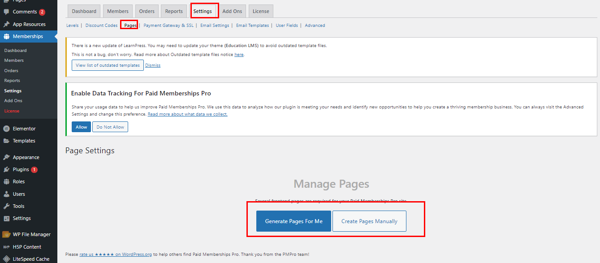
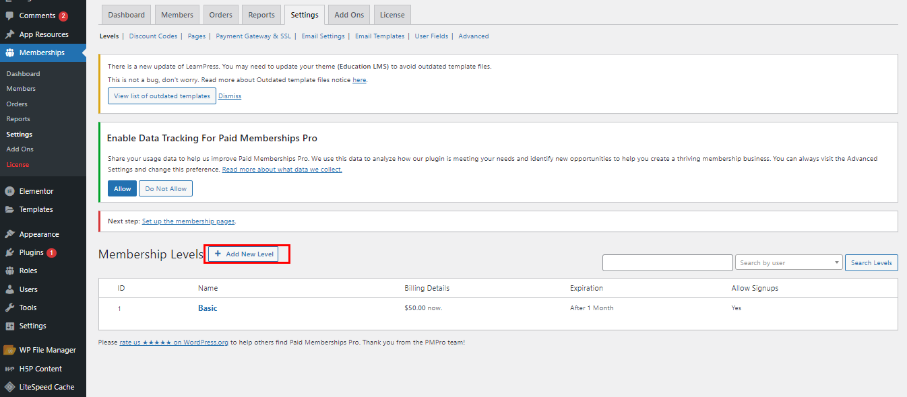
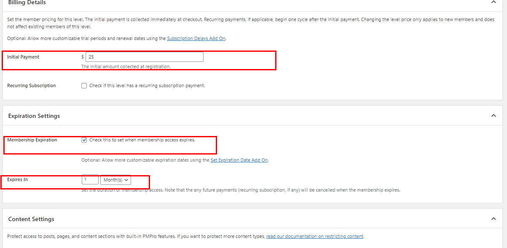
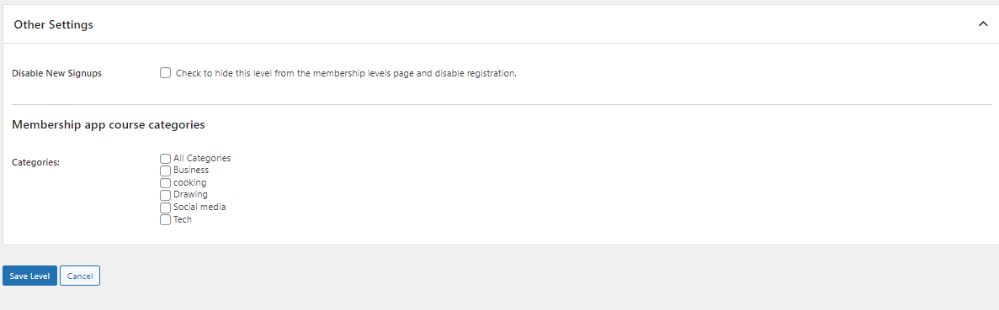

## Paid Membership pro integration

First, make sure to install [paid membership pro wordpress plugin](https://wordpress.org/plugins/paid-memberships-pro/). Free version of the plugin is enough. You don't have the need to purchase pro version.

Generate all required pages manually or automatically from settings.

Add New Level from Settings > levels

Set basic membership details and set initial payment cost and expiration duration of the membership.

Under other settings, in Membership app course categories, set the categories that users will get access during the membership duration.

Finally, save level and membership will be published and available on app.