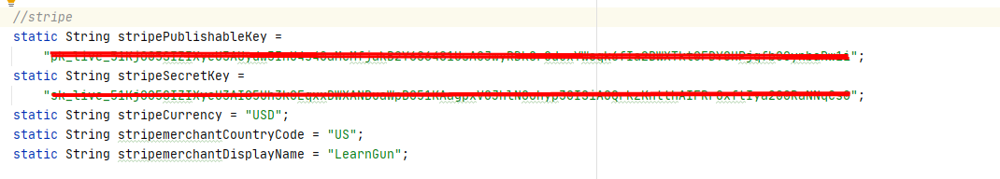
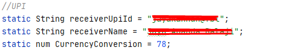
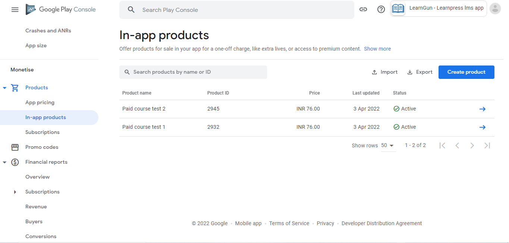
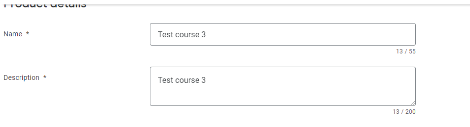

## payment gateways

open **lib/utils/constants.dart**

### Paypal

> check out this tutorial for complete details to get client api key and secret: [https://www.appinvoice.com/en/s/documentation/how-to-get-paypal-client-id-and-secret-key-22](https://www.appinvoice.com/en/s/documentation/how-to-get-paypal-client-id-and-secret-key-22)

just change the below details in the constants.dart file:

**paypal_clientId** - Your paypal client ID that you can get from dashboard

**paypal_secret** - Your paypal client secret that you can get from dashboard

**returnURL** - Any link which will be cached after user successful payment, recommended to be your website url

**cancelURL** - Any link which will be cached after user cancelled payment, recommended to be your website url

**paypal_transaction_description** - Payment description that will be shown on your dashboard

**paypal_note_payer** - Text that will be shown to buyer

### Stripe

> check out this tutorial for complete details to get publishable key and secret key: [https://stripe.com/docs/keys](https://stripe.com/docs/keys)

**stripePublishableKey** - Your Stripe Publishable Key

**stripeSecretKey** - Your Stripe Secret Key

**stripeCurrency** - Currency code as per [https://stripe.com/docs/currencies](https://stripe.com/docs/currencies)

**stripemerchantCountryCode** - Your country code as per [https://gist.github.com/jylopez/7a3eb87e94981a579303a73cf72a5086](https://gist.github.com/jylopez/7a3eb87e94981a579303a73cf72a5086)

**stripemerchantDisplayName** - Name that will be displayed during payment

### UPI

**receiverUpiId** - UPI ID of the receiver

**receiverName** - Name of the receiver as per the UPI platform

### IN-App Purchases

No additional configuration is needed on code. In app purcahase units needed to be added for all courses manually. Below is the instruction to add in app purchase for products.

Go to **In-app products** from your app's android app developer console dashboard and click on create product

**Product ID** must be the **course id**, which is the one that can be found **"?post="** in the link of edit course of the course that you want to add in app purchases.

**Name** and **description** can be the course name

**Set price** needs to be selected and price needs to be given as per your currency and **Apply Price** needs to be selected and finally the in app purchase unit needs to be saved. 

### RazorPay

just change the below in the constants.dart file:

**razorPayApiKey** - RazorPay Api Key that you got from it's website.