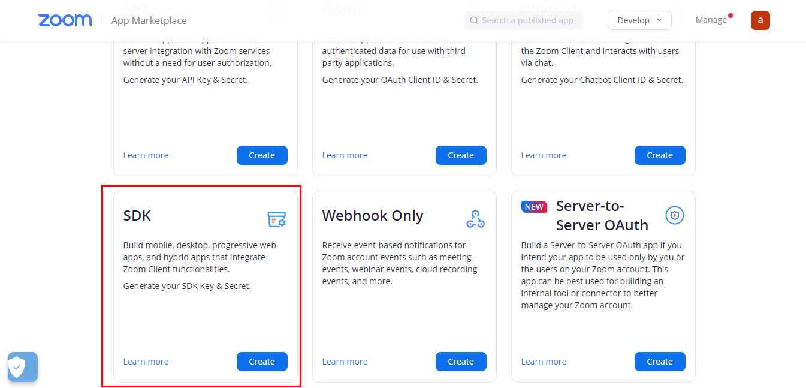
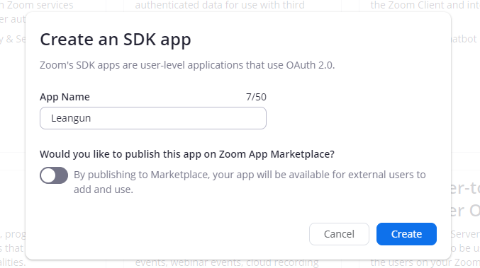
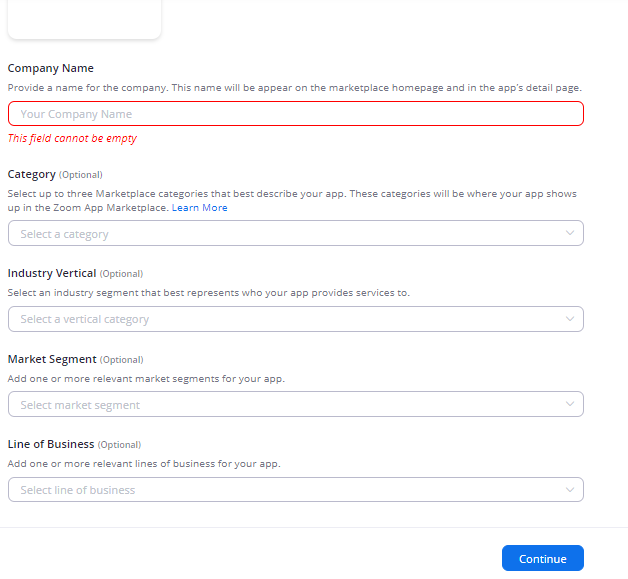
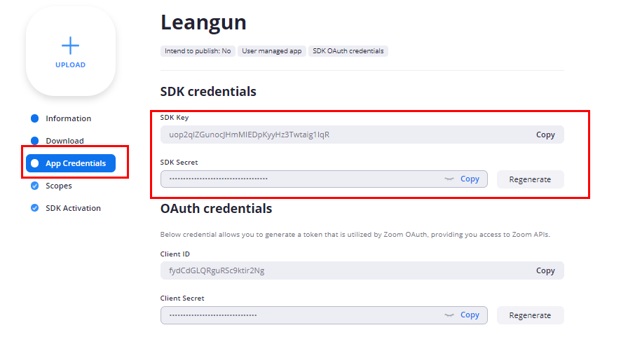
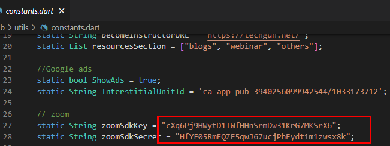

## Zoom webinars and lesson meeting integration

1. Install and activate [Video Conferencing with Zoom wordpress plugin](https://wordpress.org/plugins/video-conferencing-with-zoom-api/) on your wordpress website.

2. [Follow this tutorial and configure the plugin on your site](https://thimpress.com/tutorial-to-integrate-zoom-with-learnpress/).

3. Go to [zoom developers marketplace](https://marketplace.zoom.us/develop/create) after loggin in to your zoom account and hit "create" on "SDK".

4. Enter the name of your app and hit "Create".

5. Enter the required details "Company Name" and "Developer Contact Information" and other optional details that are applicable for you and hit "continue".

6. Go to **"App credentials"** and copy **"SDK Key"** and **"SDK Secret"** and paste them in **"zoomSdkKey"** and **"zoomSdkSecret"** variables in **lib/utils/constants.dart** in our code.

7. Thats it !!! Now all your scheduled meetings in website will be showing in webinars in resources and zoom added to learnpress lessons will be showing in app.