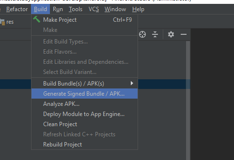
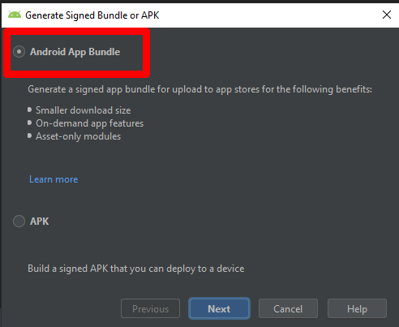
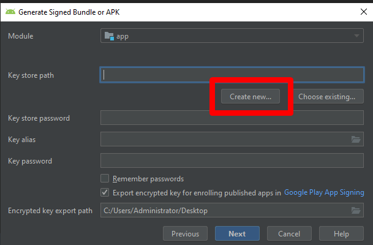
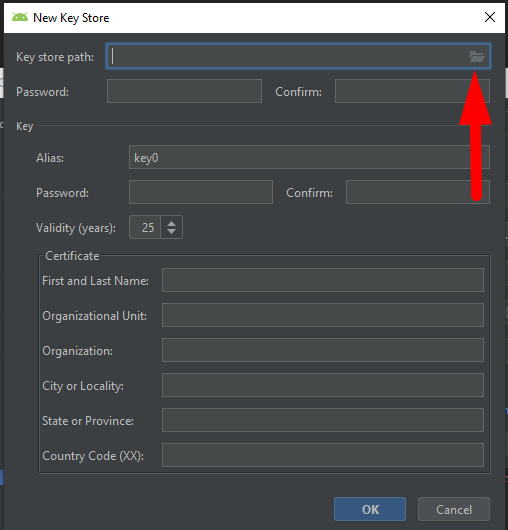
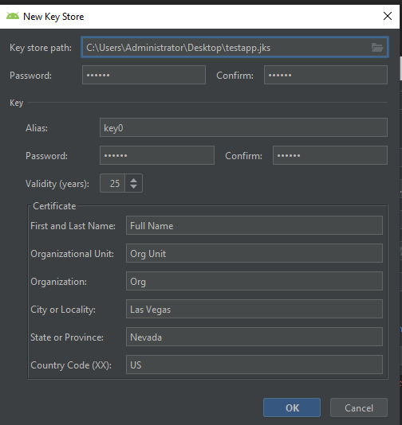
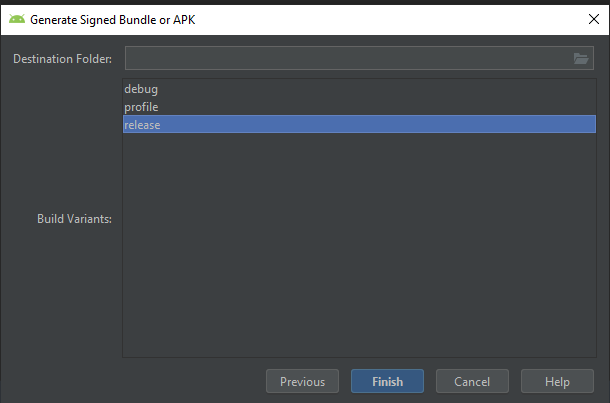

## App Release

After you tested your app, you can sign the app for release to Google Play.

> This manual aims to display all the key steps for generating a signed app bundle. Please follow this link for the more detailed guide: [https://developer.android.com/studio/publish/app-signing#sign-apk](https://developer.android.com/studio/publish/app-signing#sign-apk)

For this, you need to open Build > Generate Signed Bundle / APK…

In the new window select Android App Bundle.

After that, in a new opened window select the Key or create a new one.

Here is an instruction on how to create a new Key. Click on the Create new. You will see the new window opened. Click on the folder icon in the right top corner.

Select the folder where the Key will be stored.

Fill in the information (all fields).

Next, check the Export encrypted key, if it is the update of the already uploaded app to the Google Play.

> Please find more information here: [https://developer.android.com/studio/publish/app-signing#enroll_existing](https://developer.android.com/studio/publish/app-signing#enroll_existing)

Now you need to select Release option and launch app building process.

After that, Android Studio will notify you that app building process is finished (see the notification in the right bottom corner).

By clicking on the Locate you will be redirected to the folder where the file is stored. Also, app bundle can be found here: Project folder > Android > App > Release

> The full guide describing how to upload the app to the Google Play Console can be found here: [https://developer.android.com/studio/publish/upload-bundle](https://developer.android.com/studio/publish/upload-bundle)