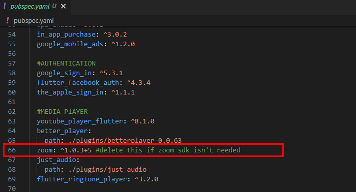
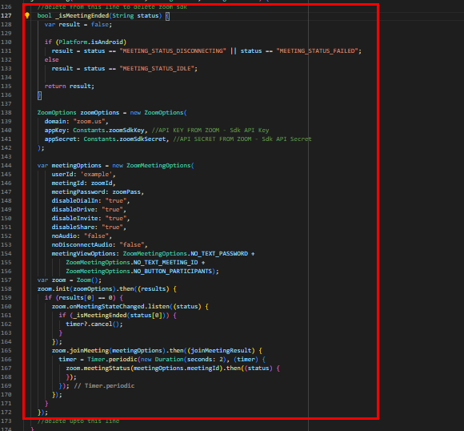
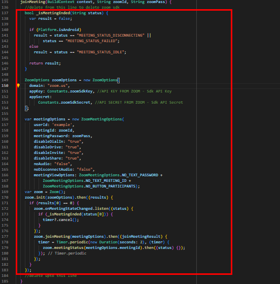
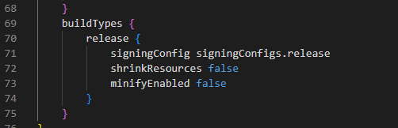

## Reducing app size

1. Currently the app size will be around 50mb when downloaded from playstore, the huge app size is due to native zoom sdk integration. If you dont want zoom webinars or zoom lessons to be integrated in app, it's possible to reduce the size of app to be around 20mb when downloaded from playstore

2. In order to remove the zoom sdk to reduce the app size, just open the following files within the code folder and remove the code lines marked
		
line 66 in **pubspec.yaml**

line 5 and line 126-173 in **lib\screens\singleWebinar.dart**

line 7 and line 136-184 in **lib\screens\singleZoom.dart**

set "shrinkResources" and "minifyEnabled" to true **android\app\build.gradle**

That's it, now the app size will be reduced to around 20mb, after uploading to playstore and downloading from it.