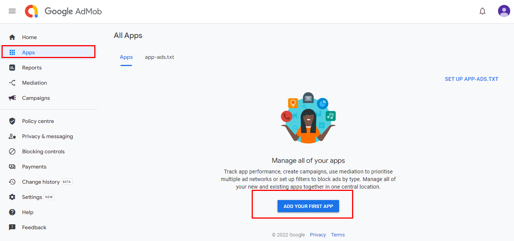
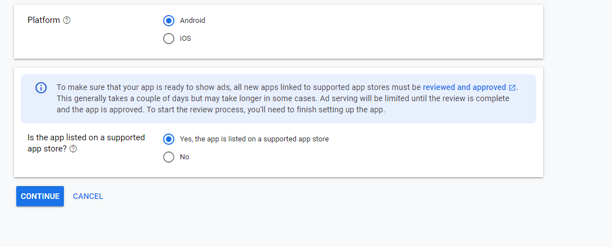
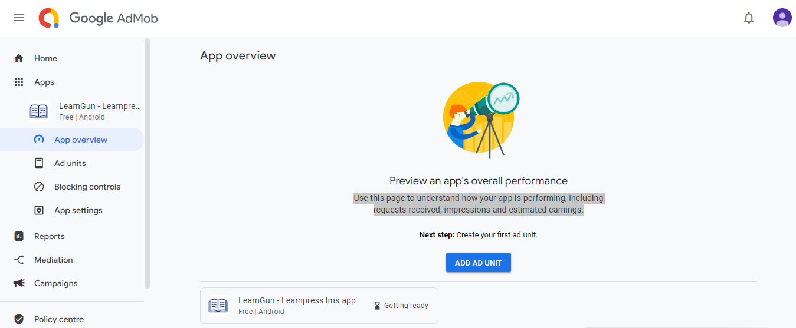
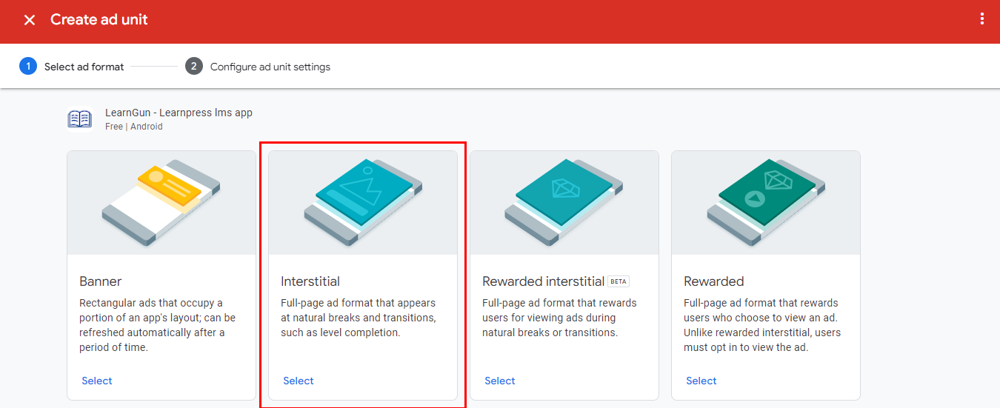
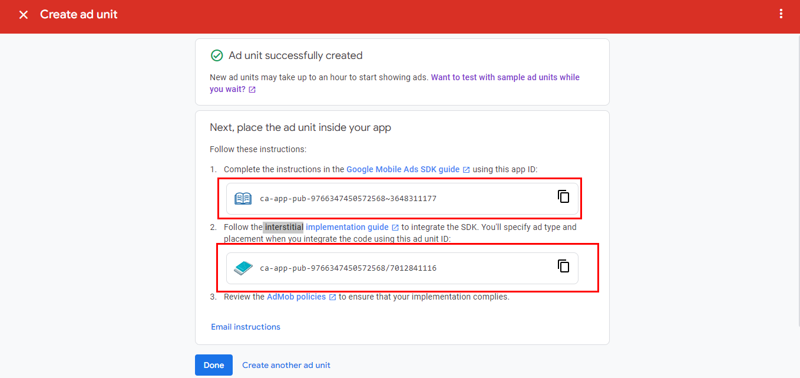
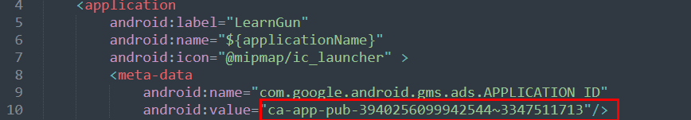
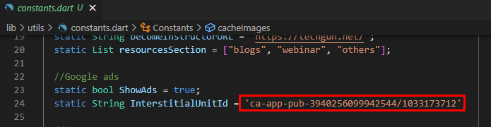

## Google admob ads in resources

1. After creating admob account from [admob website](https://admob.google.com/home/) , go to apps sections and hit "add your first app"

2. select app platform and hit "continue"

3. After adding app, hit "Add ad unit"

4. Select "interstitial" and give any name to the unit and create ad unit

5. You can find app ID and ad unit id after creating

6. Open **\android\app\src\main\AndroidManifest.xml** within our code and paste the app ID in **line 10**

7. Open **lib\Utils\constants.dart** within the code and paste **ad unit id** in **InterstitialUnitId** variable. Also, **ShowAds** variable will decide whether or not to show ads

That's it, now ads from your account will be showing in the app.