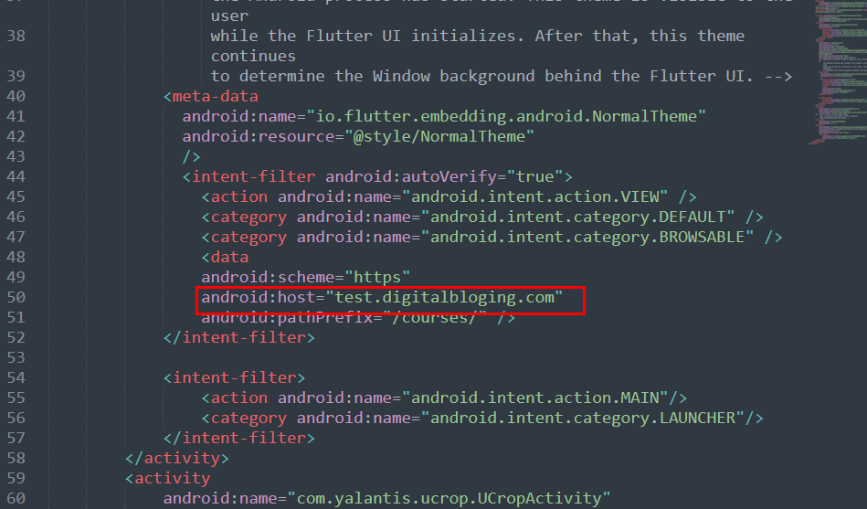
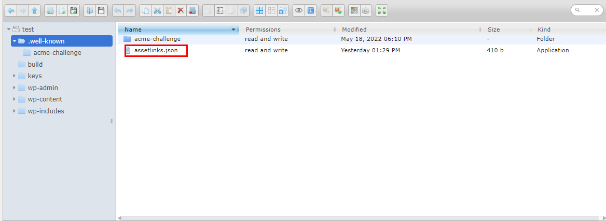
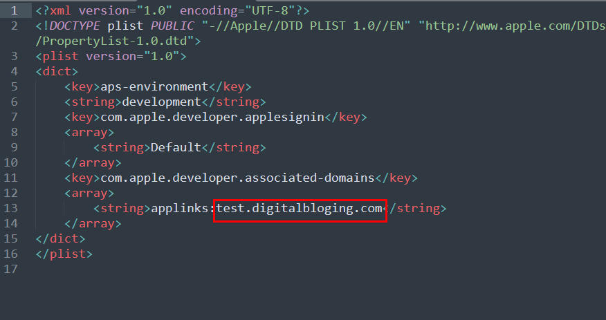

## App links for android

On **android\app\src\main\AndroidManifest.xml** within the flutter code project on **line 50** , set your website url. Make sure that you need to have SSL certificate installed on your website.

Within **.well-known** folder on your website root folder, create a file named **assetlinks.json** and paste this content on the file.

	[
    {
        "relation": [
            "delegate_permission/common.handle_all_urls"
        ],
        "target": {
            "namespace": "android_app",
            "package_name": "com.learngun.courses",
            "sha256_cert_fingerprints": [
                "3C:3E:36:EA:45:4E:52:56:1A:6E:84:A7:E5:82:0B:E9:E4:E1:C2:6E:B4:E7:2C:AA:7C:B4:46:F6:65:34:18:0C"
            ]
        }
    }
    ]

Make sure to change your **package_name** and **sha256_cert_fingerprints**
You can generate sha 256 by running the following command on android folder.

	./gradlew signingReport

## App links for IOS

On **\ios\Runner\Runner.entitlements** within the flutter code project on **line 13** , set your website url. Make sure that you need to have SSL certificate installed on your website.

Within root folder on your website, create a file named **apple-app-site-association** and paste this content on the file.

	{
    "applinks": {
        "apps": [],
        "details": [
            {
                "appID": "4996H6RZTG.com.learngun.courses",
                "paths": [ "/courses/*"]
            }
        ]
    }
	}

Make sure to change your **appID** in the format of termID.AppId
 
That's it. Now, all links will be redirected to app when app is installed on phone.